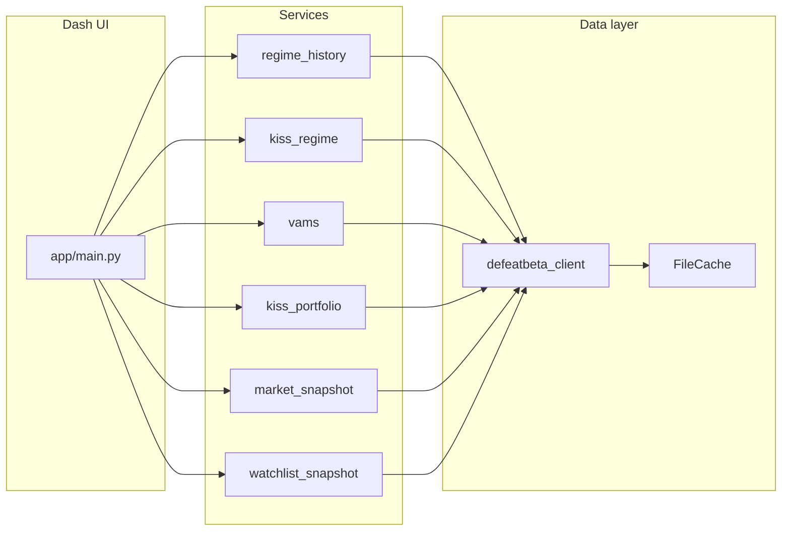

# Architecture

## Overview

`market_watch` is a **local-first** Plotly Dash application. A single location-based callback in [`app/main.py`](../app/main.py) loads data through a shared [`DefeatBetaClient`](../app/data/defeatbeta_client.py) and renders the appropriate page from [`app/pages/`](../app/pages/).

## Layers

| Layer | Role |
|-------|------|
| **UI** | Dash layout callbacks, [`app/components/ui.py`](../app/components/ui.py) |
| **Pages** | Route-specific composition in [`app/pages/`](../app/pages/) |
| **Services** | Regime, VAMS, portfolio, market snapshots in [`app/services/`](../app/services/) |
| **Data** | [`DefeatBetaClient`](../app/data/defeatbeta_client.py) wraps `defeatbeta-api`; [`FileCache`](../app/data/cache.py) persists pickled frames |
| **Config** | [`app/config.py`](../app/config.py) loads [`config/settings.yaml`](../config/settings.yaml) |

## Data flow

## Core services

- **`kiss_regime`** — Current macro quadrant from growth/inflation proxy scores (point-in-time).
- **`regime_history`** — Historical replay of the same proxy logic, indicator tape snapshots, confirmation bundles, and transition strips (`build_regime_overview_snapshot`).
- **`vams`** — Trend, momentum, volatility scoring; `get_vams_signal_history` for replay.
- **`kiss_portfolio`** — Legacy target/actual weights for `/implementation` only.
- **`market_snapshot` / signals`** — Market-wide and per-symbol alert context.
- **`watchlist_snapshot`** — Watchlist rows and ticker detail bundles for `/ticker/<symbol>`.

## Price symbols and overrides

Logical symbols (e.g. sleeve labels `AGG`, `BTC-USD`) may map to **different** defeatbeta tickers via `kiss.price_fetch_overrides` in settings. The client resolves the fetch ticker in [`DefeatBetaClient.get_prices`](../app/data/defeatbeta_client.py) while keeping cache keys tied to the **logical** symbol so the UI and models stay stable. See [configuration.md](configuration.md).

## Models

Shared dataclasses live in [`app/models.py`](../app/models.py) (e.g. `KissRegime`, `RegimeOverviewSnapshot`, `VamsSignal`, `TickerDetailBundle`).
