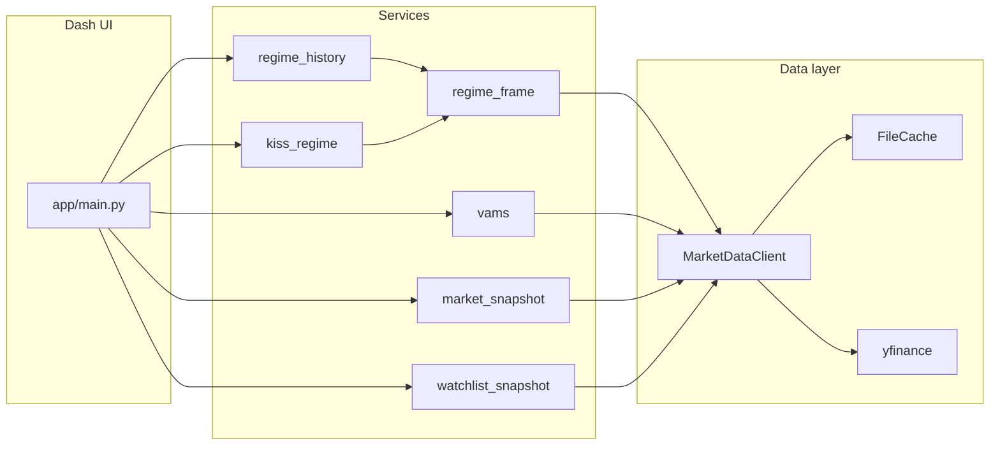

# Architecture

## Overview

`market_watch` is a **local-first** Plotly Dash application. A single location-based callback in [`app/main.py`](../app/main.py) loads data through a shared [`MarketDataClient`](../app/data/yfinance_client.py) and renders the appropriate page from [`app/pages/`](../app/pages/).

## Layers

| Layer | Role |
|-------|------|
| **UI** | Dash layout callbacks, [`app/components/ui.py`](../app/components/ui.py) |
| **Pages** | Route-specific composition in [`app/pages/`](../app/pages/) |
| **Services** | Regime, VAMS, market snapshots in [`app/services/`](../app/services/) |
| **Data** | [`MarketDataClient`](../app/data/yfinance_client.py) wraps **yfinance** (Yahoo Finance) with [`FileCache`](../app/data/cache.py) for pickled frames |
| **Config** | [`app/config.py`](../app/config.py) loads [`config/settings.yaml`](../config/settings.yaml) |

## Data flow

## Core services

- **`regime_frame`** — `build_regime_composite_frame`: outer-merge proxy series, forward-fill, and composite growth/inflation scores (shared by live regime and history replay).
- **`kiss_regime`** — Current macro quadrant from the last row of the composite frame.
- **`regime_history`** — Historical replay of the same proxy logic, indicator tape snapshots, confirmation bundles, and transition strips (`build_regime_overview_snapshot`).
- **`vams`** — Trend, momentum, volatility scoring; `get_vams_signal_history` for replay.
- **`market_snapshot`** — Benchmark indices, participation, and rates (`RatesSnapshot.spread_10y_short_proxy` for the 10Y − 5Y proxy spread).
- **`watchlist_snapshot`** — Watchlist rows and ticker detail bundles for `/watchlist` and `/ticker/<symbol>`.

## Price symbols and data sources

[`MarketDataClient.get_prices`](../app/data/yfinance_client.py) loads the **logical** symbol from Yahoo Finance. [`last_price_source`](../app/data/yfinance_client.py) records `yfinance` for UI labels (e.g. “via Yahoo Finance”). Treasury yields and S&P 500 annual return history use the same client; see [data-and-caching.md](data-and-caching.md) for ticker proxies (`^TNX`, `^FVX`, `^GSPC`, etc.).

## Regime inputs when data is missing

[`kiss_regime`](../app/services/kiss_regime.py) records unavailable proxy components in `KissRegime.unavailable_components` and omits them from composite means. [`build_regime_overview_snapshot`](../app/services/regime_history.py) surfaces warnings on the Overview page.

## Models

Shared dataclasses live in [`app/models.py`](../app/models.py) (e.g. `KissRegime`, `RegimeOverviewSnapshot`, `VamsSignal`, `TickerDetailBundle`).
